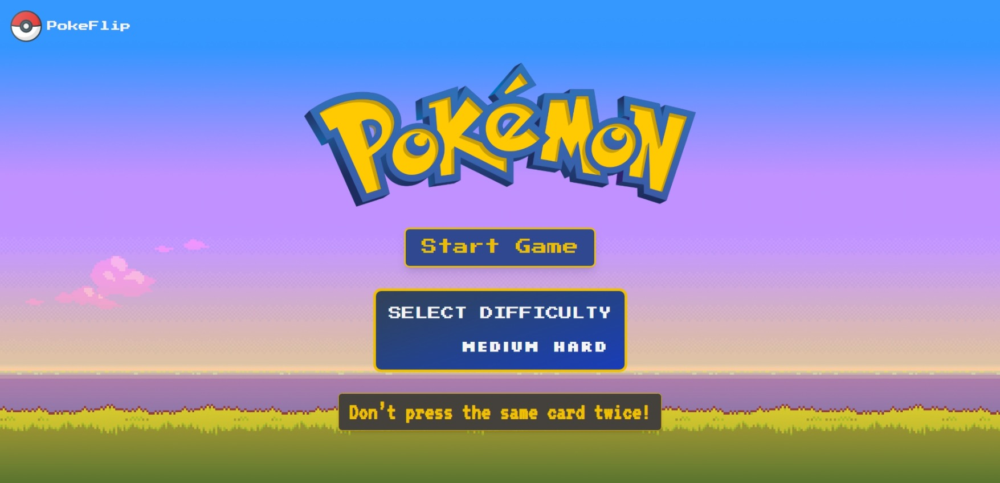
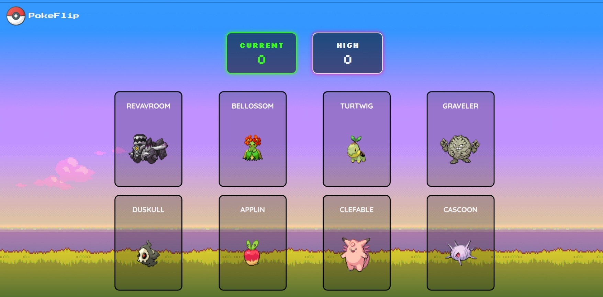
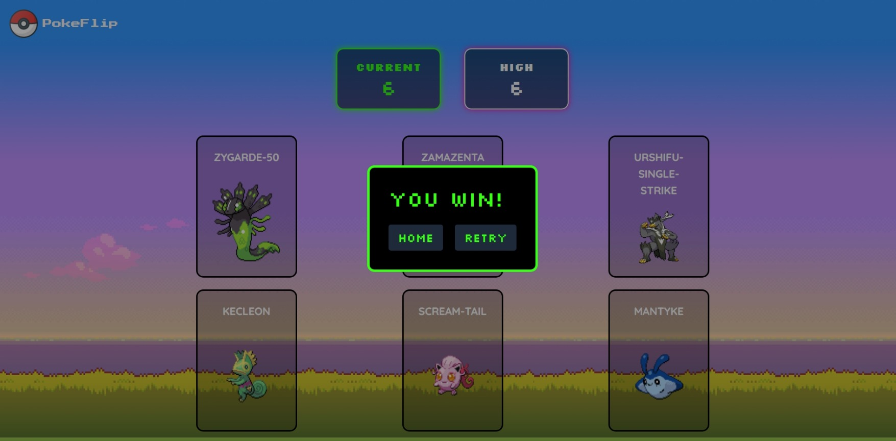

# 🎮 PokeFlip

**PokeFlip** is a Pokémon memory card game built with **React** and **Tailwind CSS**. Select unique cards without repeating to achieve the highest score.

## 📸 Screenshots

<div align="center">
  
  <br/>
  
  
  <br />

</div>

## 📝 How to Play

- Select cards without repeating any.
- Cards reshuffle after each selection.
- Selecting a duplicate ends the game.
- Select all unique cards to win.

## 🚀 Features

- Memory-based card selection logic.
- Dynamic shuffling after each correct selection.
- Difficulty levels: Easy, Medium, Hard.
- Responsive grid layout for all screen sizes.
- Tilt animation using `react-parallax-tilt`.

## 🛠️ Tech Stack

- **React** – Frontend framework.
- **Tailwind CSS** – Styling and layout.
- **react-parallax-tilt** – Card hover tilt effects.
- **PokéAPI** – Pokémon data fetching.

## 💻 Installation

```bash
git clone https://github.com/Fa1sall/PokeFlip.git
cd PokeFlip
npm install
npm run dev
```
